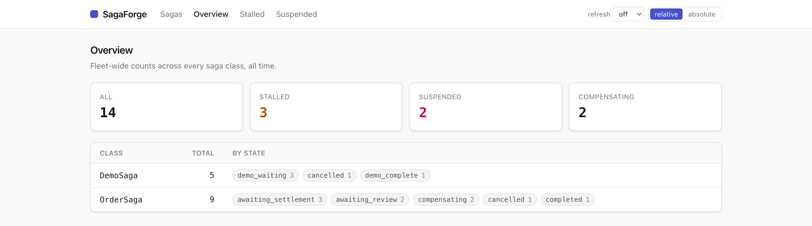
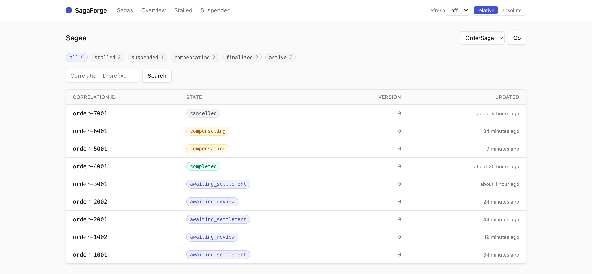
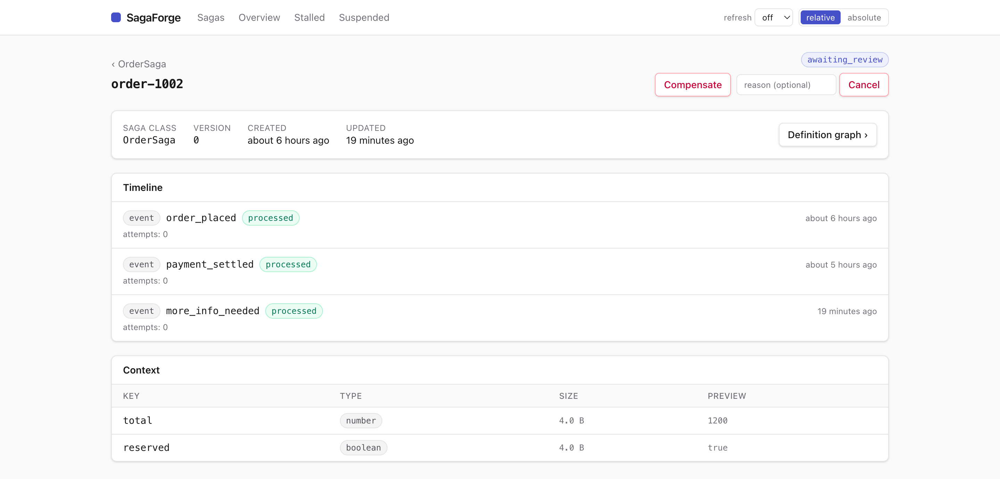
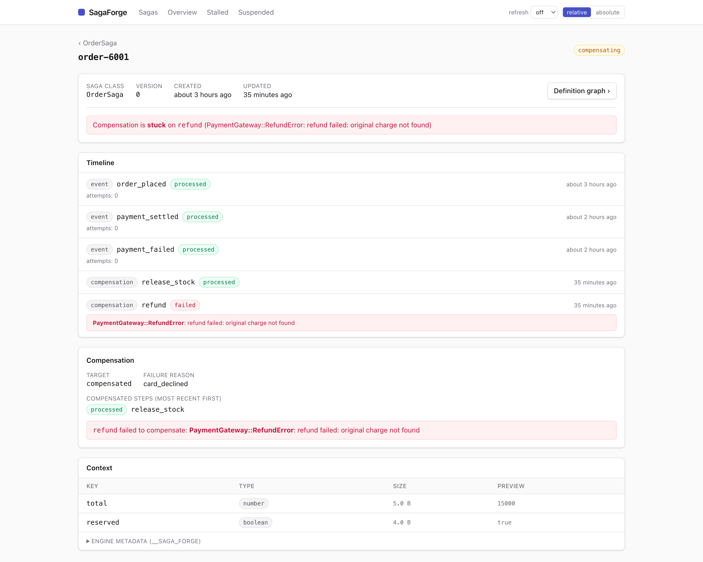
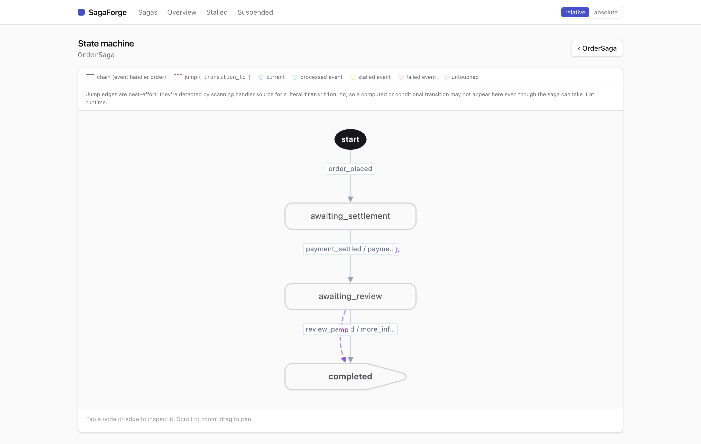
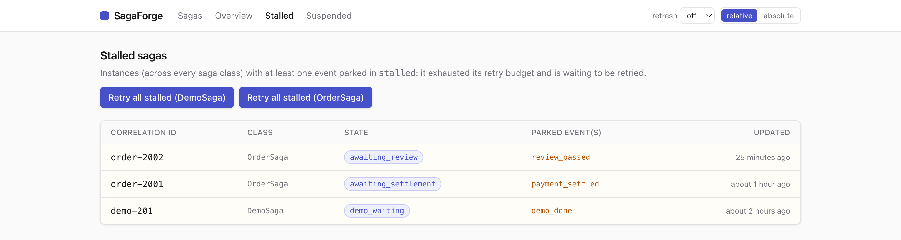
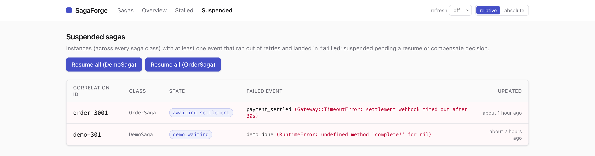

# SagaForge::Dashboard

[](MIT-LICENSE)

**A mountable Rails engine that answers the question a saga-based workflow
raises once it's live: which instances are stuck, and why?** It gives
SagaForge a triage-first dashboard with the recovery controls to act on what
it surfaces.

It is built on the event ledger every saga already keeps. The dashboard reads
that ledger per instance (every processed, parked, and failed event, with any
traceback inlined on the event that raised it), rolls it up into a fleet
overview and per-class lists, and gives you one-click retry, resume, and
compensate so recovery doesn't mean a Rails console session.

> Requires [`saga_forge`](https://github.com/radioactive-labs/saga_forge). See
> the [main README](https://github.com/radioactive-labs/saga_forge#readme) for
> saga documentation.

Early release: the UI and config API may change before `1.0`.

## Screenshots

The dashboard, page by page — there's also a [visual
tour](https://radioactive-labs.github.io/saga_forge/dashboard.html) on the
site.

| Overview |
| --- |
| [](docs/screenshots/overview.png) |
| A fleet summary across every saga class: total, then **stalled / suspended / compensating** at a glance, with one row per class broken down by current state. Every count drills into the matching filtered list. |

| Saga list | Saga detail |
| --- | --- |
| [](docs/screenshots/sagas.png) | [](docs/screenshots/saga-detail.png) |
| One class at a time: filter chips for stalled / suspended / compensating / finalized / active, a correlation-ID prefix search, keyset pagination. | The event ledger as a timeline — every event this instance received, in order, with status and attempts — over the saga's live context, with operator actions in the header. |

| Compensation |
| --- |
| [](docs/screenshots/compensating.png) |
| When a step fails, what already committed unwinds in reverse. Here `release_stock` ran but `refund` exhausted its retries mid-rollback: the banner names where it's stuck, the timeline inlines the error on the failed compensation, and the Compensation panel lists the compensated steps most-recent-first. |

| State-machine graph |
| --- |
| [](docs/screenshots/definition-graph.png) |
| A forward-only DAG of the saga's states, parsed from the class (never executed). Solid edges are the event-handler chain; dashed edges are best-effort `transition_to` jumps detected in the handler source. Node status paints on when viewed for a specific run. |

| Stalled | Suspended |
| --- | --- |
| [](docs/screenshots/stalled.png) | [](docs/screenshots/suspended.png) |
| Instances with an event parked in `stalled`: it exhausted its retry budget and is waiting to be retried. Per-class **Retry all stalled** re-enqueues the parked work in one background sweep. | Poison-pill isolation: an event that ran out of retries and landed in `failed` halts its one instance, not the fleet. Each row names the failed event and error; **Resume all** re-fires them after the fix. |

## Installation

Add to your application's Gemfile (requires `saga_forge`):

```ruby
gem "saga_forge-dashboard"
```

Then run `bundle install`, and mount the engine in `config/routes.rb`:

```ruby
mount SagaForge::Dashboard::Engine => "/saga_forge"
```

The dashboard is fail-closed: mount it without configuring
[authentication](#authentication) and every URL raises. Configure one of the
auth options below before you rely on it.

## Authentication

The dashboard is fail-closed. If you mount it without configuring
authentication, hitting any dashboard URL raises
`SagaForge::Dashboard::AuthenticationNotConfigured`. Configure one of the
following in an initializer (e.g. `config/initializers/saga_forge_dashboard.rb`).
Resolution order: custom hook, then HTTP Basic, then `:none`, else raise.

### Custom hook

```ruby
SagaForge::Dashboard.configure do |c|
  c.authenticate { |controller| controller.head(:forbidden) unless controller.current_user&.admin? }
end
```

The block runs in the controller's own context (so `instance_exec`, not a
plain call), and receives the controller instance too. Call `head(:forbidden)`
or `redirect_to` to deny access; return normally to allow it.

### HTTP Basic Auth

```ruby
SagaForge::Dashboard.configure do |c|
  c.http_basic = { username: ENV["SF_USER"], password: ENV["SF_PASS"] }
end
```

### Disable (guard the mount point instead)

Set authentication to `:none` and guard the mount point with a routing
constraint:

```ruby
SagaForge::Dashboard.configure do |c|
  c.authentication = :none
end
```

```ruby
# config/routes.rb
authenticate :user, ->(u) { u.admin? } do
  mount SagaForge::Dashboard::Engine => "/saga_forge"
end
```

## Configuration

```ruby
SagaForge::Dashboard.configure do |c|
  c.polling_interval         = 15                          # seconds; default auto-refresh interval. 0 to disable.
  c.polling_interval_options = [0, 5, 10, 15, 30, 60, 300] # selectable intervals in the nav "refresh" control
  c.page_size                = 50                          # sagas per page on the per-class index
end
```

| Option | Default | Notes |
| --- | --- | --- |
| `polling_interval` | `15` | Seconds between auto-refreshes. A viewer can override it with the nav "refresh" control (stored in a cookie). `0` disables. |
| `polling_interval_options` | `[0, 5, 10, 15, 30, 60, 300]` | Intervals (seconds; `0` = off) offered by the nav refresh control. |
| `page_size` | `50` | Sagas per page on the per-class list. |

> **The dashboard has no thresholds of its own.** Whether an instance shows up
> as stalled, suspended, or compensating comes entirely from the saga's own
> event ledger (`Event#status`) and `State#current_state`, governed by
> [`SagaForge.config`](https://github.com/radioactive-labs/saga_forge#configuration):
> `stall_wait` / `stall_budget` decide how long an early event spins before it
> parks as stalled, and `sweep_interval` decides how quickly a stranded
> compensation is picked back up. The dashboard only displays what those
> settings produce; tune them on the core gem, not here.

## Pages

- **Sagas** (`/saga_forge`): one saga class at a time (switch classes from the
  dropdown), state badges, filter by state or by the derived `stalled` /
  `suspended` / `compensating` scopes, a correlation-id prefix search, and
  keyset pagination.
- **Saga detail**: a summary banner (class, version, timestamps, and a warning
  when the instance is stalled, suspended, or stuck mid-compensation), a
  context inspector for the persisted JSON context, and a timeline merging the
  event ledger with compensation progress read from
  `context["__saga_forge"]`, chronological, with the operator actions for that
  instance.
- **Overview** (`/saga_forge/overview`): fleet-wide totals (all / stalled /
  suspended / compensating), each linking into the matching filtered list,
  plus a per-class breakdown loaded in its own turbo-frame so the cards paint
  before the heavier GROUP BY resolves.
- **Stalled** (`/saga_forge/stalled`): every instance, across every saga
  class, with at least one parked event, the parked event name(s), and a
  **Retry all stalled** button per class.
- **Suspended** (`/saga_forge/suspended`): every instance with at least one
  event that ran out of retries, the failed event's error class and message,
  and a **Resume all** button per class.
- **Definition graph** (`/saga_forge/definitions/:class`): a static diagram of
  one saga class's declared chain (`start_with` / `during` / `finish_with`),
  compiled from the class's own declarations, never executed. Chain edges,
  `transition_to` jumps, and `stay` self-loops are drawn distinctly, and
  passing `?correlation_id=` overlays one instance's actual progress on top:
  which events are processed, stalled, or failed, and where it currently
  sits.

## Operator actions

Available from a saga's detail page, and in bulk from the Stalled/Suspended
lists:

- **Retry stalled**: re-delivers every parked event for the instance.
- **Resume**: clears a failed event's attempts and error, then re-fires it,
  for after you've fixed the bug that caused it.
- **Compensate**: runs the instance's owed compensations from wherever it
  currently sits, landing it in `:compensated`.
- **Cancel**: the same rollback, but landing in `:cancelled` instead, with an
  optional reason.
- **Bulk retry / resume**: the stalled and suspended pages offer a
  class-scoped "act on all" button, fanned out by a background job so the
  request stays fast against a large backlog.

Each of these is a thin wrapper over the model methods described in the core
gem's [Operator API](https://github.com/radioactive-labs/saga_forge#operator-api);
`retry_stalled!` and `resume!` are no-ops (not errors) on an instance with
nothing eligible, so a stale button just flashes "Nothing to do."

## Development

Run a seeded preview locally (compiles the stylesheet, then boots a demo app
covering every saga health state across two saga classes):

```bash
bin/dev          # PORT=9090 bin/dev to use a different port
```

It serves at `http://localhost:9977/saga_forge` by default.

```bash
bundle exec rake   # test + standard
```

## Releasing

The dashboard is released from the monorepo root with `release:dashboard:*`
(defined in `../lib/tasks/release.rake`), which tags with the prefix
`saga_forge-dashboard-v`:

```bash
cd ..                             # monorepo root
rake release:dashboard:version    # show the next version (conventional commits)
rake release:dashboard:prepare    # bump + changelog + recompile dashboard.css (uncommitted)
git diff                          # review
rake release:dashboard:publish    # commit, build + push gem, tag + push → CI cuts the Release
```

Release **core before dashboard** — bump the dashboard's `saga_forge` floor
first if it should require the new core version. `prepare` recompiles
`dashboard.css` (`bundle exec rake tailwind:build`) so a release never ships a
stale stylesheet. See the header of `../lib/tasks/release.rake` for the full
flow.

## License

SagaForge::Dashboard is released under the [MIT License](MIT-LICENSE).
